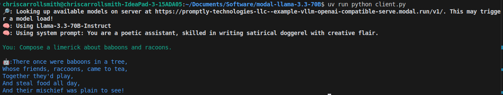

# LLama 3.3 70B Inference API Hosted on Modal

## Prerequisites

- Create a [Hugging Face account](https://huggingface.co/) and [get a token](https://huggingface.co/settings/tokens)
- Accept the [Llama 3.3 70B EULA](https://huggingface.co/meta-llama/Llama-3.3-70B-Instruct) and wait for an approval email
- Create a [Modal account](https://modal.com/)
- Add your Hugging Face token to the [Modal secrets manager](https://modal.com/secrets/) as a secret named `huggingface-secret` with key `HF_TOKEN`
- Install the `uv` package manager with `curl -LsSf https://astral.sh/uv/install.sh | sh`
    - Or `wget -qO- https://astral.sh/uv/install.sh | sh` if you don't have `curl`
- Install Python with `uv python install`
- Install [git](https://git-scm.com/)

## Setup

- Clone this repo with `git clone https://github.com/chriscarrollsmith/modal-llama-3.3-70b.git`
- Open a terminal, `cd` into this folder, then run: `uv sync`
- Create a new `.env` file in the root of the repo with a BEARER_TOKEN to protect your API (you can use `echo "BEARER_TOKEN=$(openssl rand -hex 16)" >> .env` to generate a random value and write it to the file)
- Add this token to the [Modal secrets manager](https://modal.com/secrets/) as a secret named `api-secret` with key `BEARER_TOKEN`
- Authenticate the Modal CLI by running: `uv run modal token new`
- Download the Llama 3.3 model from Hugging Face with `uv run modal run download_llama.py`
- Deploy the app by running: `uv run modal deploy vllm_inference.py`
- Test the app by running: `uv run python client.py`

